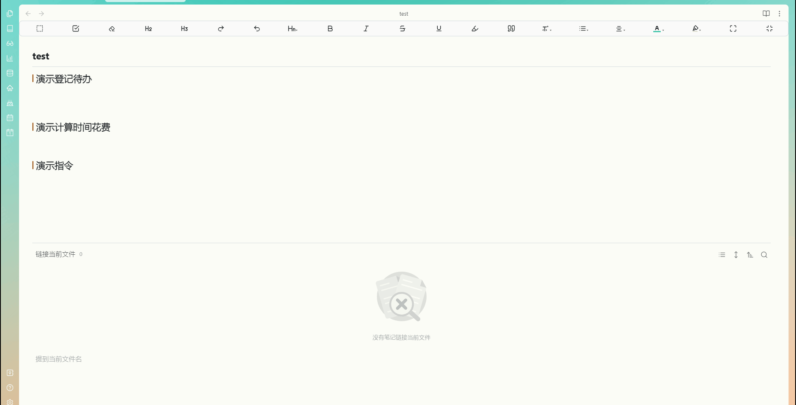
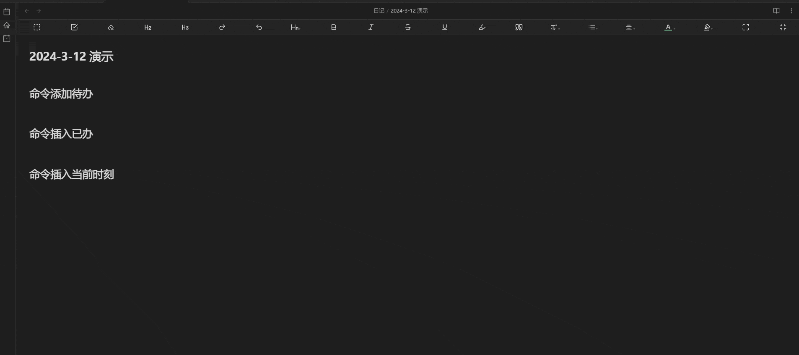
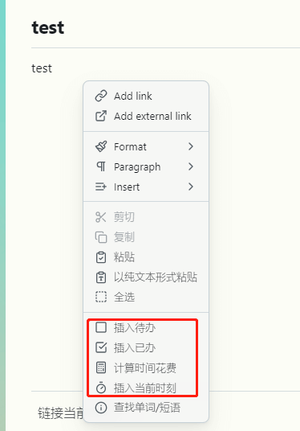
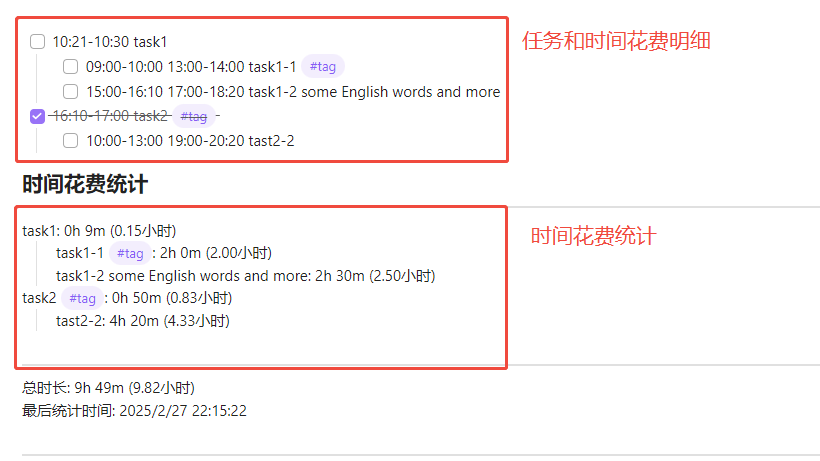

# Obsidian 任务处理扩展插件

[English README](https://github.com/odayou/task-processing-extension/blob/master/README_en.md)

> 一个 [Obsidian](https://obsidian.md/) 插件，用于统计任务的时间花费
>
> 基于自己的工作流和[一个网友的诉求](https://forum-zh.obsidian.md/t/topic/30252/4)开发的一个Obsidian插件，欢迎大家提出宝贵意见。

## 仓库地址

[odayou/task-processing-extension](https://github.com/odayou/task-processing-extension)

## 功能

1. 根据记录的明细，统计每项task的时间花费（提取当前文档中的tasks）
2. 提供了一些快捷指令，如插入待办/已办事项、插入当前时刻
3. 以上效果都有对应的指令和右键菜单

## 使用方式

在编辑视图下，在具有任务（标准task格式）、时间时刻的文档中，调用命令`total time` (或者通过右键菜单触发), 即可在光标处分别列出每个任务的时间花费并展示总花费

## 演示

- 综合演示
- 
- 几个快捷命令演示

- 所有功能都集成进了右键菜单

- 时间统计效果展示

  
## 示例数据

### 任务

```markdown
- [ ] 10:21-10:30 task1 
    - [ ] 09:00-10:00 13:00-14:00 task1-1 #tag 
    - [ ] 15:00-16:10 17:00-18:20 task1-2 some English words and more 
- [x] 16:10-17:00 task2 #tag 
    - [ ] 10:00-13:00 19:00-20:20 tast2-2 
```

### 统计结果

```markdown
### 时间花费统计
---
task1: 0h 9m (0.15小时)
    task1-1 #tag: 2h 0m (2.00小时)
    task1-2 some English words and more: 2h 30m (2.50小时)
task2 #tag: 0h 50m (0.83小时)
    tast2-2: 4h 20m (4.33小时)

---
总时长: 9h 49m (9.82小时)
最后统计时间: 2025/2/27 22:15:22

---

```
